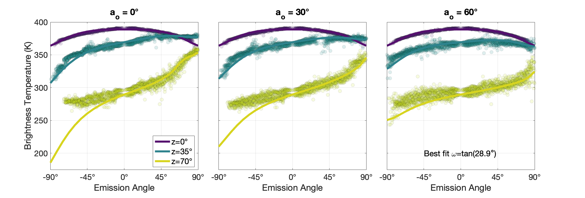

## Generalized directional emissivity model
This model generalizes the [Smith /(1967/)][https://agupubs.onlinelibrary.wiley.com/doi/abs/10.1029/JZ072i016p04059] directional emissivity model to any illumination and observation angle, and adds a new idealized topographic model: a gaussian mixture surface.

Usage:
1. Copy all files.
2. Run run.m using Matlab (Tested on 2023b).

Examples:
To use the model with the parameters used by Smith (1967), set:

```matlab
solar_zenith_angles = [0 35 70];
observation_angle = linspace(-89.9, 89.9, 25);
observation_azimuths = [0 30 60];

slope_distribution = 'gaussian';
unid_rms_slope_angle = [55];
solar_constant = 1370;
albedo = 0;
emissivity = 1;
scattering_model = 'none';
```
This will compute the radiance of a rough gaussian surface for solar zenith angle $z=0\degree$ (the configuation appearing in Smith 1967, Figure 5), as well as for two other solar zenith angles, $z=30\degree$ and $z=60\degree$, and three observation azimuths $a_o=0\degree, 30\degree, 60\degree$. The result, shown in Figure 1, clearly showes the Smith model cannot accurately simulate off-nadir thermal observations by the Lunar Reconnasience Orbiter Diviner instrument.


Figure 1

To use the model with the new gaussian-mixture surface, set:
```matlab
solar_zenith_angles = [0 35 70];
observation_angle = linspace(-89.9, 89.9, 25);
observation_azimuths = [0 30 60];

slope_distribution = 'gaussian_mixture';
unid_rms_slope_angle = [15 55];
hurst_exponent = 0.75;
solar_constant = 1370;
albedo = 'foote_11';
emissivity = 'keihm';
scattering_model = 'aha';
```

This will compute the radiance of a gaussian mixture surface for the same solar zenith and observation angles, including scattering, and assuming the solar albedo of each facet (slope) varies according to measurements by [https://www.sciencedirect.com/science/article/pii/S001910351830126X?casa_token=s8jlTP7YixUAAAAA:2b9Pkdx_BqwV4kUH73BRo5GyRrIw2CBM5jwAADi4KPp8syJXJ1Drq2L2SMWXhy7ZgpmGt4Fp][Foote et al. (2020)], and a temperature-dependent emissivity as measured by [https://www.sciencedirect.com/science/article/abs/pii/0019103584901659][Keihm (1984)]. The new model (Figure 2) provides a much better fit to Diviner data. Since the model assumes radiative equilibrium, it is less accurate when shadows dominate the surface:


Figure 2
